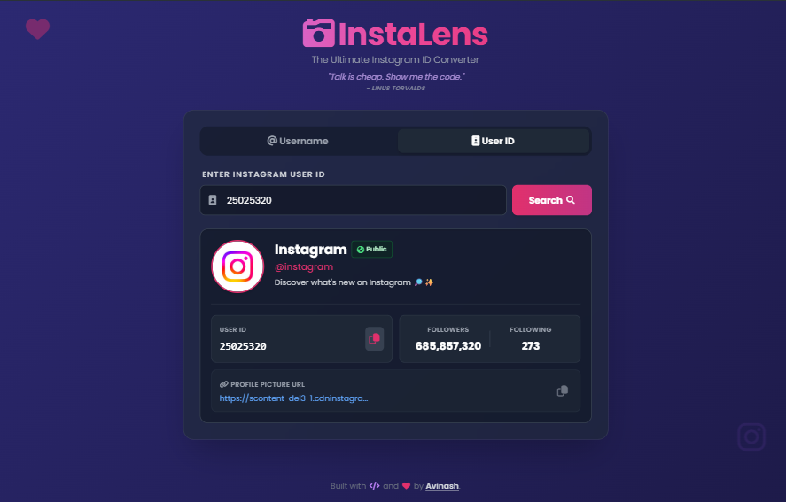

<!-- HEADER BANNER -->


<h1 align="center">📸 InstaLens</h1>

<p align="center">
  <b>Advanced OSINT Instagram ID & Username Converter</b>
</p>

<p align="center">
  <a href="https://instalens-osint.vercel.app/"></a>
  <a href="https://www.python.org/"></a>
  <a href="https://fastapi.tiangolo.com/"></a>
  <a href="https://tailwindcss.com/"></a>
</p>

<p align="center">
  <a href="https://instalens-osint.vercel.app/"><b>🌐 Live Demo</b></a> •
  <a href="#-features"><b>✨ Features</b></a> •
  <a href="#-api-endpoints"><b>📡 REST API</b></a> •
  <a href="#-local-development-setup"><b>🚀 Installation</b></a>
</p>

<p align="center">
  <a href="https://vercel.com/new/clone?repository-url=https%3A%2F%2Fgithub.com%2Facessrdpgg%2FInstaLens">
    
  </a>
</p>

---

## 🖼️ Application Preview

<p align="center">
  
</p>

---

## 🧐 What is InstaLens?

**InstaLens** is a lightweight, serverless OSINT tool engineered to bridge the gap between Instagram handles and numeric internal User IDs. Designed for security researchers, analysts, and developers, it performs dual-way conversion without requiring Instagram account credentials.

### Key Highlights
* **⚡ Dual-Direction Lookup:** Convert `@username` -> `User ID` or `User ID` -> `@username`.
* **🔄 Automatic Data Chaining:** When searching by numeric ID, the system automatically resolves the handle and triggers an auxiliary lookup for complete metadata (followers, bio, privacy status).
* **🛡️ Smart Bot Mitigation:** Utilizes header spoofing and browser fingerprinting via `cloudscraper` to bypass strict login walls.
* **🔒 Privacy Status Indicator:** Renders conditional lock (`🔒 Private`) or global (`🌐 Public`) badges based on account visibility.
* **📱 Desktop & Mobile Responsive:** Built with glassmorphism Tailwind CSS for a sleek, dark-mode native feel on all screen sizes.

---

## 🛠️ Tech Stack & Architecture

| Layer | Technology | Purpose |
| :--- | :--- | :--- |
| **Frontend** | HTML5, Vanilla JS, Tailwind CSS | Micro-scaled glassmorphism UI |
| **Backend Framework** | FastAPI (Python 3.9+) | Asynchronous API orchestration |
| **Bypass Engine** | Cloudscraper / Requests | Headers & session handling |
| **Deployment** | Vercel Serverless Functions | Zero-maintenance cloud hosting |

---

## 📡 API Endpoints

InstaLens operates as both a web application and a lightweight REST API.

### 1. Get User Data by Username
```http
GET /api/username-to-id?username=instagram
```

**Example Response:**
```json
{
  "success": true,
  "data": {
    "pk": "25025320",
    "username": "instagram",
    "full_name": "Instagram",
    "is_private": false,
    "follower_count": 668000000,
    "following_count": 81,
    "biography": "Discover what's new on Instagram."
  }
}
```

### 2. Get Handle by User ID
```http
GET /api/id-to-username?user_id=25025320
```

---

## 🚀 Local Development Setup

### Prerequisites
- Python 3.9 or higher
- Git

### 1. Clone & Navigate
```bash
git clone https://github.com/acessrdpgg/InstaLens.git
cd InstaLens
```

### 2. Setup Virtual Environment
```bash
# Windows
python -m venv venv
venv\Scripts\activate

# Linux / macOS
python3 -m venv venv
source venv/bin/activate
```

### 3. Install Dependencies & Run
```bash
pip install -r requirements.txt
uvicorn api.index:app --reload
```
Navigate to `http://127.0.0.1:8000` in your web browser.

---

## 📜 License

This project is open-source and available under the [MIT License](LICENSE).

<p align="center">
  Designed & Maintained with ❤️ by <a href="https://github.com/acessrdpgg"><b>acessrdpgg</b></a>
</p>